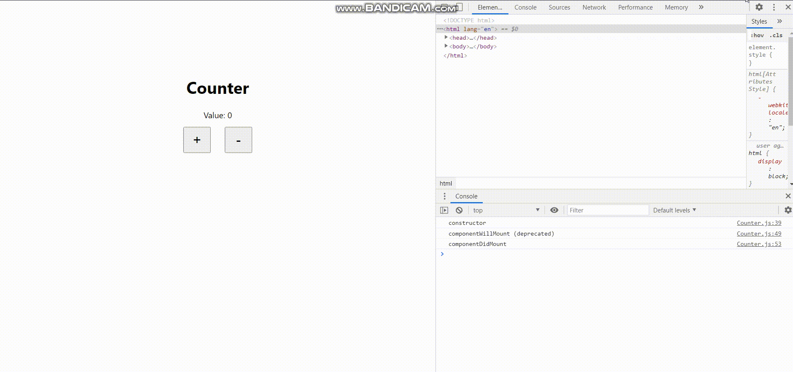

# velopert-hello-react

### 0. Purpose

VELOPERT.LOG의 React Tutorial Ch.1~5까지의 종합 결과물입니다.

### 1. Features

- state을 활용한 카운트 기능
- componentDidCatch를 사용한 Error Handling

### 2. How to use

1. <a href="https://13circle.github.io/velopert-hello-react" target="_blank">해당 repo의 GitHub Page</a>로 접속합니다.
2. 위의 GIF 예시처럼 브라우저 콘솔창을 엽니다.
3. +, - 버튼을 클릭하여 Value값을 조절합니다.
    - Value가 4가 되면 샘플로 만든 에러 메시지를 띄워줍니다.

### 3. Development Stack

- React
    - React 기초 튜토리얼이기에 순수 React만 활용하였습니다.
